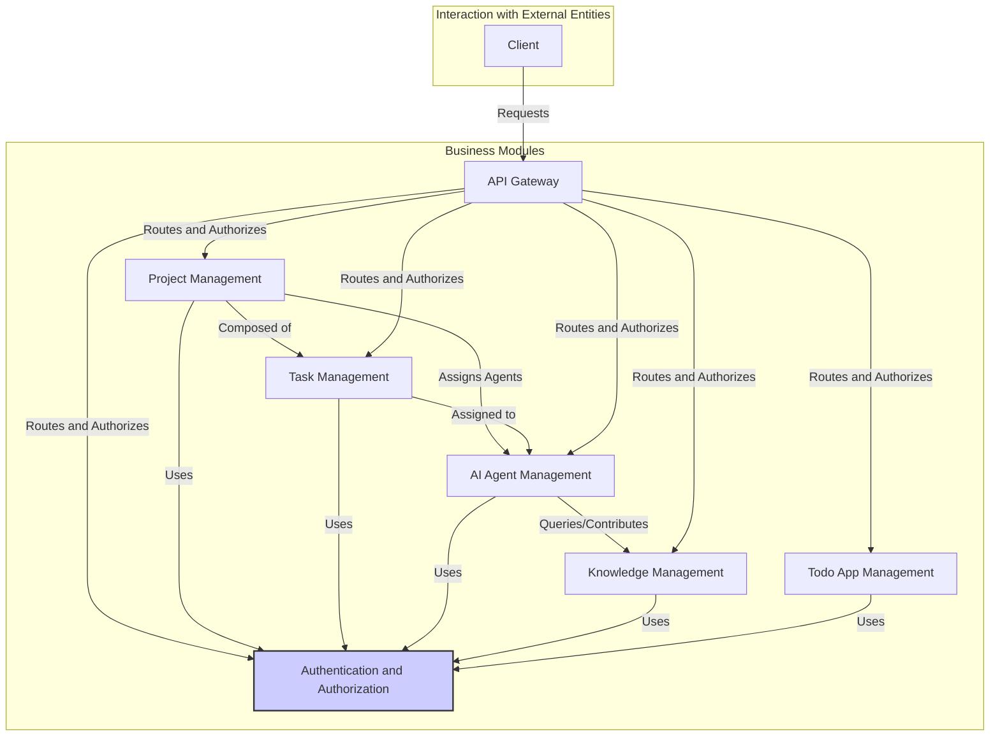

### Overall Project Goal:

The overarching business objective of this project, named dove-accelerator, is to accelerate software development through automation and the use of AI-powered agents. It aims to streamline and optimize various stages of the software development lifecycle (SDLC) by leveraging a microservices architecture and intelligent automation.

#### Decomposition of Business Objectives by Service:

Let's break down the business objectives by examining the purpose and interactions of each service defined in the docker-compose.yml:

##### Core Infrastructure:

* **nacos (Service Discovery and Configuration)**:
	+ Business Objective: Enable a dynamic and scalable microservices architecture. nacos ensures that services can discover each other, manage configurations centrally, and adapt to changes in the environment.
	+ Value: Reduces manual configuration, improves resilience, simplifies scaling, and supports efficient service management.
* **mariadb (Relational Database)**:
	+ Business Objective: Provide a persistent data store for core business data across all services.
	+ Value: Ensures data integrity, consistency, and availability for all microservices.
* **redis (Caching and Session Management)**:
	+ Business Objective: Enhance performance and manage user sessions efficiently.
	+ Value: Speeds up data access, reduces database load, improves the responsiveness of the system, and supports user authentication and authorization.
* **elasticsearch (Search and Analytics)**:
	+ Business Objective: Enable advanced search capabilities and potential data analysis over knowledge base.
	+ Value: Facilitates quick and flexible retrieval of information, providing valuable insights into the project's knowledge base.

##### Core Microservices:

* **gateway (API Gateway)**:
	+ Business Objective: Provide a single entry point for all client requests, route requests to appropriate services, and manage cross-cutting concerns (e.g., security, rate limiting).
	+ Value: Simplifies client-service interaction, enhances security, and provides centralized control over API access.
* **auth (Authentication and Authorization)**:
	+ Business Objective: Secure the system by managing user authentication and authorization.
	+ Value: Protects sensitive data, ensures only authorized users and services can access specific resources, and maintains data security and privacy.
* **agent (AI Agent Management)**:
	+ Business Objective: Manage and orchestrate AI agents that automate tasks and assist in the software development process.
	+ Value: Automates tasks, improves efficiency, reduces manual effort, and potentially enhances the quality of the developed software.
* **project (Project Management)**:
	+ Business Objective: Track and manage the lifecycle of software development projects.
	+ Value: Provides visibility into project status, facilitates collaboration, and helps keep projects organized and on track.
* **task (Task Management)**:
	+ Business Objective: Manage individual tasks that are part of a project, assigned to agents.
	+ Value: Break down project into smaller parts, assign agent to complete it, facilitate collaboration, and provides better control over the project.
* **knowledge (Knowledge Base)**:
	+ Business Objective: Create and manage a knowledge base that stores project-related information, resources, and best practices, accessible by the AI agents and project members.
	+ Value: Centralizes project knowledge, enables knowledge sharing, improves the quality of agent decisions and output, and provides a valuable resource for learning and process improvement.

### Overall Business Value Proposition:

By combining these services, dove-accelerator aims to provide the following business value:

* **Accelerated Development**: AI agents automate repetitive tasks, and efficient project management tools speed up the development lifecycle.
* **Improved Quality**: A centralized knowledge base and AI agents can contribute to better software quality.
* **Reduced Costs**: Automation of tasks and streamlined project management can reduce labor costs.
* **Increased Productivity**: Developers are freed from mundane tasks and can focus on higher-value activities.
* **Enhanced Collaboration**: A well-structured project and task management system, along with a centralized knowledge base, fosters better collaboration among team members.
* **Scalability and Flexibility**: The microservices architecture allows the system to scale as needed and adapt to changing business requirements.
* **Knowledge Sharing**: a well define knowledge base to share the information between the agent and human.

In essence, dove-accelerator is building an AI-powered platform for software development teams to work smarter, faster, and more efficiently. It's not just about automating individual tasks; it's about creating an integrated environment where AI agents can collaborate with humans to build better software.


## dove-accelerator Business Architecture

This document outlines the business architecture of the `dove-accelerator` project, focusing on its business modules and their relationships.

### Business Modules

Based on the provided documents and context, `dove-accelerator` can be decomposed into the following primary business modules:

1.  **Project Management:**
    *   **Purpose:** Manages the lifecycle of software development projects. This includes project creation, planning, status tracking, and overall project oversight.
    *   **Scope:**
        *   Project creation and definition.
        *   Project planning and scheduling.
        *   Project member management.
        *   Project status tracking and reporting.
        *   Phase management (creation, update, etc.)
        * Project pause, start, complete.

2.  **Task Management:**
    *   **Purpose:** Breaks down projects into smaller, actionable tasks. It allows for task assignment, tracking, and progress reporting.
    *   **Scope:**
        *   Task creation and definition.
        *   Task assignment to agents.
        *   Task status tracking (e.g., to-do, in-progress, completed).
        *   Task progress monitoring.
        *   Task prioritization.

3.  **AI Agent Management:**
    *   **Purpose:** Manages the AI agents that perform automated tasks within the system. This includes agent creation, configuration, lifecycle management, and monitoring.
    *   **Scope:**
        *   Agent registration and creation.
        *   Agent configuration and customization.
        *   Agent lifecycle management (start, stop, pause).
        *   Agent health monitoring.
        *   Agent-project assignment.
        * Agent-task assignment.

4.  **Knowledge Management:**
    *   **Purpose:** Provides a centralized repository for project-related information, resources, and best practices.
    *   **Scope:**
        *   Knowledge base creation and maintenance.
        *   Knowledge article creation and management.
        *   Search capabilities for the knowledge base.
        *   Access control to the knowledge base.
        * potential data analysis over knowledge base.

5.  **Authentication and Authorization:**
    *   **Purpose:** Secures the system by managing user accounts, authentication, and access control.
    *   **Scope:**
        *   User registration and management.
        *   User login and authentication.
        *   Role-based access control (RBAC).
        *   Authorization for accessing resources and functionalities.

6.  **API Gateway:**
    *   **Purpose:** Provides a single entry point for external clients and manages cross-cutting concerns like security, rate limiting, and request routing.
    *   **Scope:**
        *   Request routing to appropriate services.
        *   API authentication and authorization.
        *   Rate limiting and traffic management.

7. **Todo App Management**:
    * **Purpose**: a demo app to show the ability of this platform.
    * **Scope**: create, update, delete todo task, set priority, set deadline.
    * **Feature**: create, update, delete, list the todo task, filter, order, user login, data statistic.

### Business Module Relationships

The business modules interact with each other to achieve the overall project goals. Here's a breakdown of their key relationships:

1.  **Project Management <-> Task Management:**
    *   **Relationship:** Projects are composed of tasks. The Project Management module uses the Task Management module to break down projects into smaller, manageable units.
    *   **Interaction:**
        *   Creating a project triggers the creation of related tasks.
        *   Project progress is determined by the completion of its tasks.

2.  **Project Management <-> AI Agent Management:**
    *   **Relationship:** Projects can be assigned to AI agents, and tasks within a project can be completed by agents.
    *   **Interaction:**
        *   The Project Management module requests the AI Agent Management module to assign agents to projects.
        *  assign phase to agent.
        *   Project progress is affected by the agents' performance on assigned tasks.

3.  **Task Management <-> AI Agent Management:**
    *   **Relationship:** Tasks are assigned to and executed by AI agents.
    *   **Interaction:**
        *   The Task Management module requests the AI Agent Management module to assign agents to specific tasks.
        *   Agents report task completion status to the Task Management module.

4.  **Knowledge Management <-> AI Agent Management:**
    *   **Relationship:** AI agents access the knowledge base to gather information and make decisions.
    *   **Interaction:**
        *   Agents query the knowledge base for relevant information.
        *   Agents may contribute new knowledge based on their experiences.

5.  **Authentication and Authorization <-> All Other Modules:**
    *   **Relationship:** All other modules rely on the Authentication and Authorization module to secure their resources and functionalities.
    *   **Interaction:**
        *   All modules authenticate and authorize users through the Authentication and Authorization module.

6. **API Gateway <-> All Other Modules**:
    * **Relationship**: all the other modules expose their interface through api gateway, API Gateway do the auth and route.
    * **Interaction**:
        * client request gateway to call the other service api.

7. **Todo App Management <-> Project, Task, Agent, Knowledge**
    * **Relationship**: todo app is a simple demo app, it can use the function in other module.
    * **Interaction**:
        * user will login by `auth` service
        * user can create a project, create a task, assign a task to an agent.
        * agent can use the knowledge.

### Diagram



### Summary
The dove-accelerator project has a well-defined business architecture that separates concerns into distinct modules. This modular design enables the system to be flexible, scalable, and efficient. The interactions between these modules create a cohesive ecosystem where AI agents can assist in various stages of the software development lifecycle, guided by projects, tasks, and a centralized knowledge base. The todo app can use the functions defined by these module.


## dove-accelerator Core Business Processes

This document outlines the core business processes of the `dove-accelerator` project, focusing on the workflows and interactions between the various business modules.

### Core Business Processes

Based on the provided documentation and context, here are the core business processes within the `dove-accelerator` system:

1.  **Project Creation and Setup:**
    *   **Description:** This process outlines how a new software development project is created and configured within the system.
    *   **Steps:**
        1.  **Project Initiation:** A user (e.g., a project manager) initiates the creation of a new project.
        2.  **Project Definition:** The user defines the project's name, description, and other relevant details.
        3.  **Project Planning:** The user sets up the project phases, goals, and timeline.
        4. **Assign Agent to Project**: The user can assign the agent to a project or phase.
        5.  **Project Member Management:** The user adds members to the project, define the role of members.

    *   **Flowchart:**

        ```mermaid
        graph TD
            A[Initiate Project Creation] --> B{Define Project Details};
            B --> C{Setup Project Phases};
            C --> D{Assign Agent};
            D --> E{Manage Member};
            E --> F[Project Created and Configured];
        ```

2.  **Task Creation and Assignment:**
    *   **Description:** This process details how tasks are created within a project and assigned to AI agents for execution.
    *   **Steps:**
        1.  **Task Creation:** A user (e.g., project manager or developer) creates a new task within a project.
        2.  **Task Definition:** The user defines the task's title, description, requirements, and deadline.
        3.  **Task Assignment:** The user or the system (based on pre-defined rules) assigns the task to one or more AI agents.
        4.  **Task Prioritization:** The user sets the priority level for the task.
        5. **Task Start**: agent start to work for the task.

    *   **Flowchart:**
        ```mermaid
        graph TD
            A[Create New Task] --> B{Define Task Details};
            B --> C{Assign Task to Agent(s)};
            C --> D{Set Task Priority};
            D --> E[Task Ready for Agent Execution];
        ```

3.  **AI Agent Task Execution:**
    *   **Description:** This process outlines how AI agents perform assigned tasks, leveraging the knowledge base and interacting with other agents.
    *   **Steps:**
        1.  **Task Pickup:** An AI agent identifies and picks up an assigned task from the task queue.
        2.  **Knowledge Retrieval:** The agent queries the knowledge base for relevant information and resources.
        3.  **Task Execution:** The agent performs the task based on its capabilities, the task description, and the retrieved knowledge.
        4.  **Agent Collaboration:** If required, the agent communicates and collaborates with other agents to complete the task.
        5.  **Task Update:** The agent updates the task status (e.g., in-progress, completed) and provides any relevant output or artifacts.
        6. **Task report**: agent will report it's work to user, like task status.

    *   **Flowchart:**
        ```mermaid
        graph TD
            A[Agent Picks Up Task] --> B{Query Knowledge Base};
            B --> C{Execute Task};
            C --> D{Collaborate with Other Agents (if needed)};
            D --> E{Update Task Status};
            E --> F[Task Completion Report];
        ```

4.  **Knowledge Base Interaction:**
    *   **Description:** This process outlines how AI agents and users interact with the knowledge base.
    *   **Steps:**
        1.  **Query Knowledge:** An AI agent or a user queries the knowledge base for specific information.
        2.  **Search and Retrieval:** The knowledge base searches for relevant articles, documents, or resources.
        3.  **Knowledge Access:** The agent or user accesses the retrieved knowledge.
        4.  **Knowledge Contribution:** An agent or a user may contribute new information or update existing knowledge.
        5. **Knowledge Data Analysis**: Data analysis over knowledge base.

    *   **Flowchart:**

        ```mermaid
        graph TD
            A[Agent/User Initiates Knowledge Query] --> B{Search Knowledge Base};
            B --> C{Retrieve Relevant Knowledge};
            C --> D{Access Knowledge};
            D --> E{Contribute/Update Knowledge};
            D -->F{Data Analysis};
        ```

5.  **User Authentication and Authorization:**
    *   **Description:** This process ensures that only authorized users can access the system and its functionalities.
    *   **Steps:**
        1.  **Login Request:** A user attempts to log in to the system.
        2.  **Authentication:** The system verifies the user's credentials against the user database.
        3.  **Session Management:** If authentication is successful, the system creates a user session.
        4.  **Authorization:** Based on the user's roles and permissions, the system determines what resources and functionalities the user can access.
        5. **Logout**: User logout.

    *   **Flowchart:**

        ```mermaid
        graph TD
            A[User Login Request] --> B{Authenticate User Credentials};
            B -- Success --> C{Create User Session};
            B -- Failure --> D[Authentication Failed];
            C --> E{Authorize User Access};
            E --> F[User Access Granted];
            F --> G{User Logout};
        ```

6. **Todo App Management**:
    * **Description**: this is a simple app, to show the ability of this platform.
    * **Steps**:
        1. **User Login**: user need to login to use this app.
        2. **Create Todo Task**: User can create a todo task.
        3. **Update Todo Task**: User can update the todo task.
        4. **Delete Todo Task**: User can delete a todo task.
        5. **List Todo Task**: user can list all todo task.
        6. **Filter**: user can filter the todo task by some condition.
        7. **Order**: user can order the todo task by some condition.
        8. **Data Statistic**: get the data statistic of the todo tasks.

    * **Flowchart**:
    ```mermaid
    graph TD
        A[User Login] --> B{Create Todo Task};
        B --> C{Update Todo Task};
        C --> D{Delete Todo Task};
        D --> E{List Todo Task};
        E --> F{Filter Todo Task};
        F --> G{Order Todo Task};
        G --> H{Data Statistic}
    ```

### Business Process Interactions

*   **Project Management** drives **Task Management** by creating and defining tasks.
*   **Task Management** relies on **AI Agent Management** to assign and execute tasks.
*   **AI Agent Management** interacts with **Knowledge Management** to obtain the information needed to complete tasks.
*   All modules depend on **Authentication and Authorization** for security.
* All modules expose their interface through **API Gateway**.
* **Todo App Management** can use the functions defined by `Project`, `Task`, `Agent`, `Knowledge`, `Auth` module.

### Summary

These core business processes define how the `dove-accelerator` system operates. By effectively managing projects, tasks, AI agents, and a knowledge base, the system aims to streamline and accelerate the software development lifecycle, enabling AI agents to collaborate with humans to build better software.
The Todo App Management show the basic feature of this platform.


## AI Agent Collaboration and Inter-Agent Communication

The `dove-accelerator` project envisions a collaborative environment where multiple AI Agents, each with specialized roles and capabilities, work together to accomplish complex software development tasks.  This section details how AI Agents interact, communicate, and coordinate their efforts.

### Multiple AI Agent Interaction in Task Execution

Within the **"AI Agent Task Execution"** core business process, here's how multiple AI Agents can interact, particularly in a scenario where Agent B's task depends on the completion and output of Agent A's task:

1.  **Task Decomposition and Dependency Definition:**
    *   When a complex task is initially defined (in the "Task Creation and Assignment" process), the system or a user (e.g., a project manager) may decompose it into sub-tasks.
    *   These sub-tasks can have dependencies. For example, "Write API Documentation" (Agent B's task) might depend on "Develop API Endpoints" (Agent A's task) being completed first.
    * These dependency information will be stored in `Task` entity.

2.  **Task Assignment with Dependency Awareness:**
    *   When assigning these sub-tasks, the system (or the AI Agent Management module) is aware of the dependencies.
    *   Agent A is assigned the "Develop API Endpoints" task.
    *   Agent B is assigned the "Write API Documentation" task, but the system records that this task is *dependent* on the successful completion of Agent A's task.

3.  **Agent A's Task Execution and Output:**
    *   Agent A picks up the "Develop API Endpoints" task.
    *   Agent A may query the knowledge base for relevant information (e.g., API design guidelines, existing endpoint patterns).
    *   Agent A performs its task, which involves generating code for the API endpoints.
    *   **Crucially:** Agent A produces output, which could include:
        *   Code files containing the API endpoint implementations.
        *   A list of the created API endpoints (e.g., their names, input parameters, output types).
        *   Test cases for the endpoints.
        *   Other relevant artifacts.
    *   Agent A updates the task status to "completed" and provides the output data.

4.  **Triggering Agent B:**
    *   **Event-Driven Trigger:** Once Agent A completes its task and updates its status, the system (likely the Task Management module or a specific agent coordinator within the AI Agent Management module) detects this event.
    *   **Dependency Check:** The system checks if there are any tasks dependent on Agent A's completed task.
    *   **Agent B Notification:** The system identifies Agent B's "Write API Documentation" task as dependent and notifies Agent B that its task is now ready for execution.
    *   **Output Provision:** Along with the notification, the system provides Agent B with the output data generated by Agent A.

5.  **Agent B's Task Execution:**
    *   Agent B receives the notification and the output data from Agent A.
    *   Agent B picks up the "Write API Documentation" task.
    *   Agent B uses the output from Agent A (e.g., the list of endpoints, code files) to write the API documentation.
    *   Agent B may also query the knowledge base for documentation guidelines and standards.
    *   Agent B completes its task and provides its output (e.g., the API documentation files).

6. **Agent task report**: Agent A and Agent B will report the task result to the user, and update the task status.

### Mechanisms for Inter-Agent Communication and Collaboration

To facilitate this type of multi-agent interaction, the `dove-accelerator` system likely uses the following mechanisms:

1.  **Message Queues (e.g., RocketMQ):**
    *   Agent A can publish a "task completed" message to a specific queue, including the output data.
    *   Agent B (or the system) can subscribe to this queue and receive the message, triggering its task execution.
    *   Queues can also be used for other types of communication, such as:
        *   Requests for information from other agents.
        *   Status updates on task progress.
        *   Requests for collaboration or assistance.

2.  **API Calls:**
    *   Agents can also call each other's APIs directly to exchange information. For example, Agent A might have an API endpoint that returns its output data. Agent B can then call this API to retrieve the necessary information.
    * These API will be managed by the `API Gateway`

3. **Task Management module**
   * this module can know the relationship between tasks.
   * this module can know the relation between agent and task.
   * this module can check the task status.
   * this module will trigger the task based on the dependency.

4.  **Shared Data Storage (e.g., MariaDB, Redis):**
    *   Agents can read and write data to shared databases or caches. For example, Agent A might store its output data in a specific location, and Agent B can then read this data from that location.
    *   These data should be stored in `Task` entity.

5. **Agent coordinator**:
   * Agent coordinator can be a part of the AI Agent Management module.
   * It can know the task status.
   * It can trigger the next task.

### Summary

The `dove-accelerator` system's design supports complex, multi-agent collaborations. By defining task dependencies, using event-driven mechanisms, and providing clear communication channels, the system enables AI Agents to work together in a coordinated fashion, much like a team of human developers. This allows for the efficient completion of complex software development projects.


## dove-accelerator: Core Business Processes (Most Essential - Final Refinement)

This document outlines the *most essential* business processes in the `dove-accelerator` project, focusing on the core workflows that deliver its primary value proposition: AI-assisted, automated software development. This analysis incorporates all the context and information provided in previous conversations and documents.

### Core Business Process 1: AI-Driven Software Development - Task Execution within a Project

This is the **heart** of the `dove-accelerator` system. It represents how AI Agents, guided by a project's structure and leveraging a shared knowledge base, actively contribute to the software development process.

*   **Trigger:** A task is created within a project, either manually by a user or through the automated project management process.
*   **Precondition**: System startup and AI Agent Initialization.
*   **Steps:**
    1.  **Task Creation and Definition (Task Management):**
        *   A user (e.g., Project Manager, Product Manager) or the system defines a task within the context of a project (what needs to be done, requirements, etc.).
        *   Dependencies between tasks can be defined.
        *   The `task` service handles this, including storing the task details and dependencies.
    2.  **Task Assignment (Task & Agent Management):**
        *   The Project Manager AI Agent, or the system, assigns the task to one or more AI Agents based on their roles, capabilities, and the task's requirements.
        *   The `task` and `agent` services collaborate to determine and execute the assignment.
    3.  **Agent Task Pickup (Agent Management):**
        *   An available and appropriate AI Agent identifies an assigned task and begins working on it.
        *   The `agent` service manages this process.
    4.  **Knowledge Retrieval (Knowledge Management):**
        *   The AI Agent queries the knowledge base for relevant information, guidelines, or code examples.
        *   The `knowledge` service handles these queries and provides the necessary information.
    5.  **Task Execution (Agent Management):**
        *   The AI Agent executes the task.
        *   This involves various actions based on the task type, such as code generation, documentation writing, testing, or other development-related activities.
        *   Agents may collaborate with each other, using the communication mechanisms described below, if the task requires it.
        *   The `agent` service is central to this step.
    6.  **Task Status Update and Reporting (Task Management):**
        *   The AI Agent reports on task progress (e.g., "in-progress") and completion.
        *   The AI Agent updates the task's status in the system.
        *   The AI agent reports the result to the user.
        *   The `task` service handles the reporting and status updates.
    7. **Trigger Next Task**:
       * Based on the dependency, the system will trigger the next task.
*   **Mechanisms for Agent Collaboration:**
    *   **Message Queues:** Agents can use message queues to notify each other of task completion or to request help.
    *   **API Calls:** Agents can call other agents' APIs to exchange information directly. The `gateway` service provide the api entrance.
    *   **Shared Data:** Agents can read and write data to shared storage (MariaDB, Redis) to pass information or artifacts.
    * **Task dependency**: Tasks can have dependencies, when the task is done, then trigger the next task.
    * **Agent coordinator**: it can know the task status and trigger the next task.
*   **Services Involved:**
    *   `task` (primary)
    *   `agent` (primary)
    *   `knowledge`
    *   `project` (for project context)
    *   `gateway` (for agent call)

### Core Business Process 2: Project Initiation, Management, and AI Agent Assignment

This process sets the stage for AI-driven development by providing the necessary structure and resources.

*   **Trigger:** A customer requirement or internal need for a new software project is identified.
* **Precondition**: system started, and the AI Agent have been init.
*   **Steps:**
    1.  **Project Creation (Project Management):**
        *   A user (e.g., a Project Manager) initiates a new project within the system.
        *   Project details are defined (name, description, goals, scope, phases, etc.).
        *   The `project` service handles this.
    2. **Agent Assignment (Project Management):**
        * User assign the agent to the project, or to the project phase.
        * The `project` and `agent` service will handle this.
    3.  **Task Decomposition (Project/Product Manager/Architect AI Agents):**
       * The project manager/product manager/architect will break down the project into smaller task.
        * The `task` service will handle this.
    4.  **Project Tracking and Management (Project Management):**
        *   The system tracks the project's overall status, progress, and milestones.
        *   Users can view project status.
        *   Users can start, pause, or complete the project.
        *   The `project` service handles this.
*   **Services Involved:**
    *   `project` (primary)
    *   `agent` (for project/phase assignment)
    *   `task` (for task definition)
    *   `auth` (for user actions)

### Core Business Process 3: Secure Access - User Authentication and Authorization

This is a fundamental process that protects all other processes.

*   **Trigger:** Any user attempts to interact with the system.
*   **Steps:**
    1.  **User Login (Authentication & Authorization):**
        *   The user provides credentials (username, password).
        *   The `auth` service verifies credentials against the user database.
    2.  **Session Management (Authentication & Authorization):**
        *   If successful, the `auth` service creates a user session.
        *   `redis` is used to store session data.
    3.  **Authorization Check (Authentication & Authorization):**
        *   Before allowing access to any resources or actions, the `auth` service (or other services) checks the user's roles and permissions.
    4. **Logout**
       * The user logout.
*   **Services Involved:**
    *   `auth` (primary)
    *   `redis` (for session management)
    *   All other microservices (for authorization checks)
    * `gateway` (for request auth)

### Core Business Process 4: API access

* **Trigger**: user or other service call the system.
* **Steps**:
    1. **Request**: request to the `gateway` service.
    2. **Auth check**: `gateway` will check the auth.
    3. **Route**: `gateway` service route the request to the right service.
    4. **Response**: return the response.
* **Service involved**:
    * `gateway` (primary)
    * other service.
    * `auth` (auth check)

### Core Business Process 5: Todo App Management

* **Trigger**: user login to the system.
* **Steps**:
    1. **User login**: use the `auth` service.
    2. **Create Todo Task**: Create a todo task.
    3. **Update Todo Task**: Update a todo task.
    4. **Delete Todo Task**: Delete a todo task.
    5. **List Todo Task**: List todo tasks.
    6. **Filter**: Filter the todo task.
    7. **Order**: Order the todo task.
    8. **Data Statistic**: Get the data statistic of the todo task.
* **Service involved**:
    * `auth` (for user login)
    * `gateway` (api entrance)
    * `project` (create project)
    * `task` (create task)
    * `agent`(agent)
    * `knowledge` (knowledge)

### Precondition

1.  **System Startup**: the system need to be startup.
2. **AI Agent initialization**: the AI agent should be initialized.

### Simplified Workflow Summary

1.  **Input:** A customer (or user) defines a new software development requirement.
2.  **Structure:** A new project is created to organize the work.
3.  **Planning**: assign agent to the project or project phase.
4.  **Decomposition:** The project is broken down into actionable tasks.
5.  **Assignment:** Tasks are assigned to the AI Agents based on their capabilities.
6.  **Execution:** The AI Agents work on their assigned tasks, collaborating if needed.
7.  **Knowledge:** A knowledge base is used to inform the AI Agents.
8. **Report**: AI agent report the task result.
9. **Trigger**: trigger the next task based on the dependency.
10. **API**: all api call go through the `gateway`.
11. **Todo app**: demo the platform ability.
12. **Security**: all the process need `auth` service to check.

### Summary

These five core processes, and the preconditions, represent the *most essential* workflows in the `dove-accelerator` project.  They define how:

*   AI Agents contribute directly to software development.
*   Software projects are structured and managed.
*   The system ensures that only authorized users can access its resources.
* The system provide api.
* The system can show its ability.

All other features and processes are built to support these fundamental workflows. By focusing on these core processes, the `dove-accelerator` system effectively delivers its primary value proposition: **AI-assisted, automated software development.**


