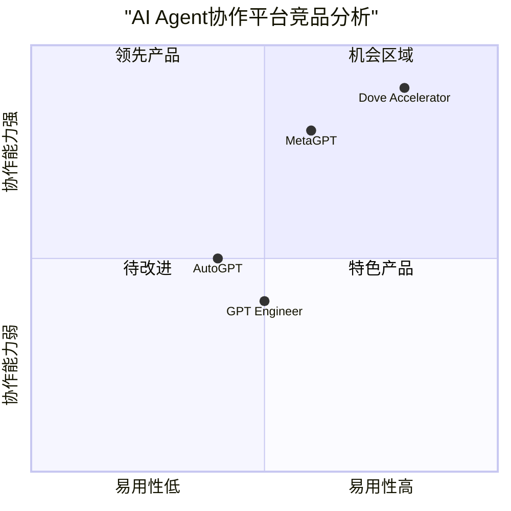

# Dove Accelerator - AI Agent协同工作系统 PRD文档

## 1. 项目概述

### 1.1 项目信息
- 项目名称：dove-accelerator
- 开发语言：Java（后端）、React（前端）
- 技术架构：前后端分离的微服务架构
- 数据库：MariaDB

### 1.2 项目背景
随着AI技术的快速发展，企业对高效的软件开发团队需求日益增长。本项目旨在创建一个革命性的AI Agent协同工作系统，通过模拟真实的企业级开发团队，提供24/7不间断的软件开发服务。

### 1.3 原始需求
建立一个能够创建和管理AI Agent软件项目团队的系统，每个AI Agent都具备20年以上的专业经验水平，能够24小时持续工作，完成企业级项目开发任务。

## 2. 产品目标

### 2.1 核心目标
1. 打造业内领先的AI Agent协同开发平台，实现企业级项目的自动化开发
2. 提供完整的软件开发生命周期管理，确保项目交付质量
3. 建立高效的多角色AI Agent协作机制，最大化团队生产力

### 2.2 用户故事
1. 作为项目经理，我希望能够快速组建AI开发团队，以便及时响应客户需求
2. 作为产品经理，我希望AI Agent能够准确理解并细化需求，以确保产品符合预期
3. 作为开发人员，我希望系统能提供清晰的任务分配和代码协作机制
4. 作为测试人员，我希望能够自动化执行测试案例并生成测试报告
5. 作为运维人员，我希望系统能够提供完整的部署和监控方案

## 3. 竞品分析

### 3.1 主要竞品
1. MetaGPT
   - 优势：
     * 结构化的多Agent框架
     * 完整的软件开发团队角色模拟
     * 标准化的操作流程
   - 劣势：
     * 缺乏可视化构建器
     * 部署复杂度高
     * 需要较强的技术背景

2. AutoGPT
   - 优势：
     * 自主任务分解能力强
     * 灵活的互联网资源访问
     * 短期记忆维护机制
   - 劣势：
     * 团队协作能力有限
     * 缺乏完整的项目管理功能
     * 任务连续性欠佳

### 3.2 竞品分析图表

## 4. 功能需求

### 4.1 核心功能模块（P0优先级）

#### 4.1.1 AI Agent管理系统
- Agent角色创建和配置
  * 支持创建客户、项目经理、产品经理、架构师等角色
  * 为每个角色配置专业知识库和决策模型
  * 角色能力评估和调优机制

- 知识库管理
  * 构建专业领域知识图谱
  * 经验案例库维护
  * 持续学习和知识更新

- Agent协作机制
  * 标准化通信协议
  * 任务分配和协调
  * 冲突解决机制

#### 4.1.2 项目管理系统
- 项目生命周期管理
  * 需求收集和分析
  * 项目计划和进度追踪
  * 资源分配和调度

- 团队协作工作流
  * 任务分解和分配
  * 进度监控和报告
  * 文档自动生成

### 4.2 技术规格

#### 4.2.1 系统架构
- 后端技术栈：
  * Java 17+
  * Spring AI
  * Spring Cloud微服务架构
  * Maven构建工具

- 前端技术栈：
  * React框架
  * Tailwind CSS
  * 国际化支持

- 数据存储：
  * MariaDB主数据库
  * Redis缓存

#### 4.2.2 系统性能要求
- 响应时间
  * 页面加载：<3秒
  * API响应：<1秒
  * 实时通信：<100ms

- 并发处理
  * 支持100+并发项目
  * 单项目支持50+ AI Agent

### 4.3 UI设计要求

#### 4.3.1 布局规范
- JIRA风格的三栏布局
  * 左侧导航菜单
  * 中间主内容区
  * 右侧详情面板

#### 4.3.2 交互设计
- 拖拽操作支持
- 实时状态更新
- 快捷键支持

## 5. 发布计划

### 5.1 第一期（3个月）
- 基础平台搭建
- AI Agent核心功能实现
- 基本项目管理功能

### 5.2 第二期（2个月）
- 团队协作功能完善
- 自动化流程建设
- 监控系统建设

### 5.3 第三期（1个月）
- 性能优化
- 安全加固
- UI/UX改进

## 6. 风险评估

### 6.1 技术风险
- AI Agent决策准确性
- 系统稳定性和可靠性
- 数据安全性

### 6.2 解决方案
- 建立AI Agent行为监控机制
- 实施多重备份和故障转移
- 采用高等级加密和访问控制

## 7. 开放问题

1. AI Agent的知识库如何持续更新和优化？
2. 如何确保AI Agent产出的代码质量达到企业级水平？
3. 多个AI Agent之间的冲突如何解决？
4. 如何评估AI Agent的专业能力是否达到20年经验水平？
5. 系统扩展性如何满足更多类型角色的加入？

## 8. 大模型集成

### 8.1 多模型支持
- 支持集成多种大语言模型
  * GPT系列（GPT-4、GPT-3.5等）
  * Claude系列
  * Llama系列
  * 国产大模型（文心一言、讯飞星火等）

### 8.2 模型配置管理
- AI Agent角色与模型绑定
  * 支持为不同角色配置不同的大模型
  * 可根据任务特性动态切换模型
  * 支持模型性能评估和对比

### 8.3 模型调用接口
- 统一的模型调用接口
  * 标准化的提示词模板
  * 统一的响应格式
  * 错误处理机制

### 8.4 成本控制
- 模型使用成本管理
  * 按角色设置模型使用配额
  * 成本统计和预警
  * 智能模型选择策略

## 9. 后续迭代规划

### 9.1 Prompt系统增强
- Prompt Pattern体系建设
  * 角色设定（Role Playing）
  * 步骤分解（Task Decomposition）
  * 示例对比（Example Comparison）
  * 链式思维（Chain of Thought）
  * ReAct模式集成

- Prompt配置管理平台
  * Prompt模板管理系统
  * 版本控制和历史追踪
  * A/B测试支持
  * 动态调整机制

- Prompt效果评估体系
  * 性能指标定义
  * 评估机制建立
  * 优化建议系统

### 9.2 预期收益
- 提升AI Agent的专业能力
- 增强系统的可配置性
- 支持持续优化和改进
