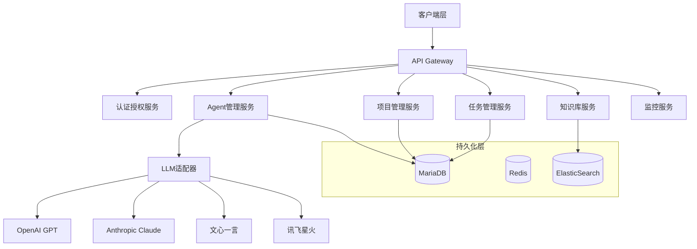
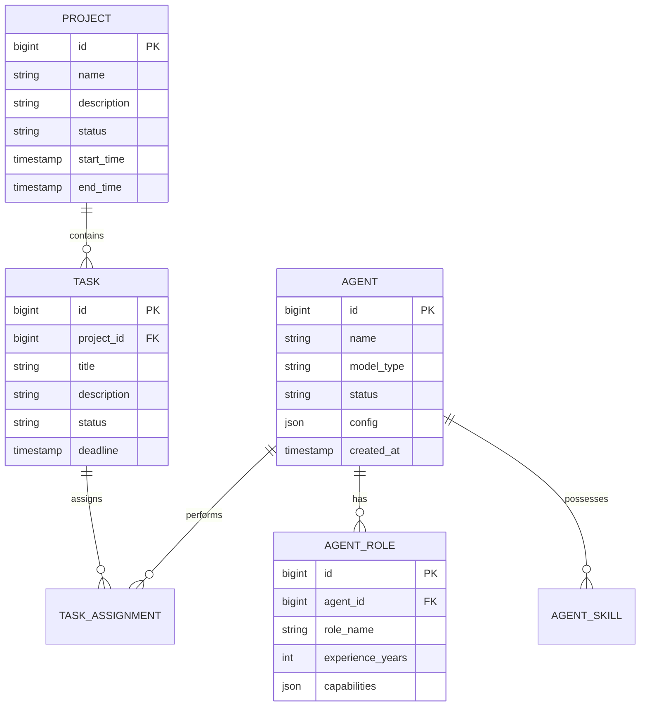

# Dove Accelerator系统架构设计文档

## 1. 实现方案分析

### 1.1 技术选型
- 微服务框架：Spring Cloud Alibaba
- AI框架：Spring AI + LangChain4j
- 多语言模型支持：
  * OpenAI GPT系列
  * Anthropic Claude
  * 百度文心一言
  * 讯飞星火
  * 通过LLM Adapter实现可扩展的模型接入
- 服务网关：Spring Cloud Gateway
- 服务注册与发现：Nacos
- 消息队列：RocketMQ
- 缓存：Redis
- 数据库：MariaDB
- 监控系统：Prometheus + Grafana
- 日志系统：ELK Stack

### 1.2 关键技术难点及解决方案
1. AI Agent协作机制
   - 采用基于Actor模型的消息传递机制
   - 实现基于知识图谱的任务分配系统
   - 使用规则引擎处理角色冲突

2. 大规模并发处理
   - 采用微服务架构实现水平扩展
   - 使用分布式缓存优化性能
   - 实现任务异步处理机制

3. 数据一致性
   - 采用Saga分布式事务模式
   - 实现最终一致性方案
   - 使用版本控制管理状态变更

## 2. 系统总体架构

### 2.1 微服务架构图


## 3. 前端架构设计

### 3.1 技术栈
- React 18+
- Redux Toolkit (状态管理)
- React Router (路由管理)
- Tailwind CSS (样式框架)
- i18next (国际化)
- Jest + React Testing Library (测试)

### 3.2 多终端支持方案
- 响应式布局设计
- PWA支持
- 统一的状态管理
- 端适配层设计

## 4. 后端架构设计

### 4.1 服务模块划分
1. 认证授权服务 (auth-service)
2. Agent管理服务 (agent-service)
3. 项目管理服务 (project-service)
4. 任务管理服务 (task-service)
5. 知识库服务 (knowledge-service)
6. 监控服务 (monitor-service)

### 4.2 技术架构
- Spring Cloud Alibaba
- Spring Boot 3.x
- Spring AI
- Maven多模块项目

## 5. 数据库设计

### 5.1 核心表结构


## 6. API接口设计

### 6.1 RESTful API
```yaml
/api/v1:
  /agents:
    post: # 创建Agent
    get: # 获取Agent列表
    /{agentId}:
      get: # 获取Agent详情
      put: # 更新Agent
      delete: # 删除Agent
  /projects:
    post: # 创建项目
    get: # 获取项目列表
    /{projectId}:
      get: # 获取项目详情
      put: # 更新项目
      delete: # 删除项目
  /tasks:
    post: # 创建任务
    get: # 获取任务列表
    /{taskId}:
      get: # 获取任务详情
      put: # 更新任务
      delete: # 删除任务
```

### 6.2 WebSocket API
```yaml
/ws/v1:
  /agent-communication: # Agent间实时通信
  /task-updates: # 任务状态实时更新
  /system-notifications: # 系统通知
```

## 7. 安全架构设计

### 7.1 安全框架
- Spring Security
- OAuth2/OIDC认证
- JWT令牌

### 7.2 安全措施
1. 接口访问控制
   - 基于角色的访问控制(RBAC)
   - API网关层的请求过滤
   - 服务间调用鉴权

2. 数据安全
   - 敏感数据加密
   - 数据传输加密(TLS)
   - 数据访问审计

## 8. 部署架构设计

### 8.1 容器化部署
- Docker容器化
- Kubernetes编排
- Helm包管理

### 8.2 部署拓扑
```mermaid
flowchart TB
    subgraph LoadBalancer[负载均衡层]
        Nginx[Nginx]\nHAProxy[HAProxy]
    end
    
    subgraph K8S[Kubernetes集群]
        Gateway[API Gateway Pod]
        Services[微服务Pods]
        Cache[Redis Pod]
        Queue[RocketMQ Pod]
    end
    
    subgraph Database[数据库集群]
        Master[(MariaDB Master)]-->Slave[(MariaDB Slave)]
    end
    
    subgraph Monitoring[监控系统]
        Prometheus
        Grafana
        ELK[ELK Stack]
    end
    
    LoadBalancer-->Gateway
    Gateway-->Services
    Services-->Cache
    Services-->Queue
    Services-->Database
    K8S-->Monitoring
```

## 9. 待明确的问题

1. 是否需要支持自定义AI模型接入？
2. Agent知识库的具体存储格式和更新机制？
3. 系统的具体性能指标要求？
4. 是否需要支持多区域部署？
5. 具体的数据备份和灾难恢复要求？